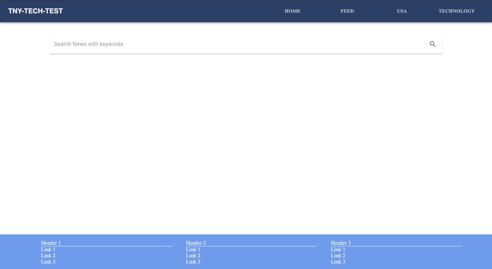
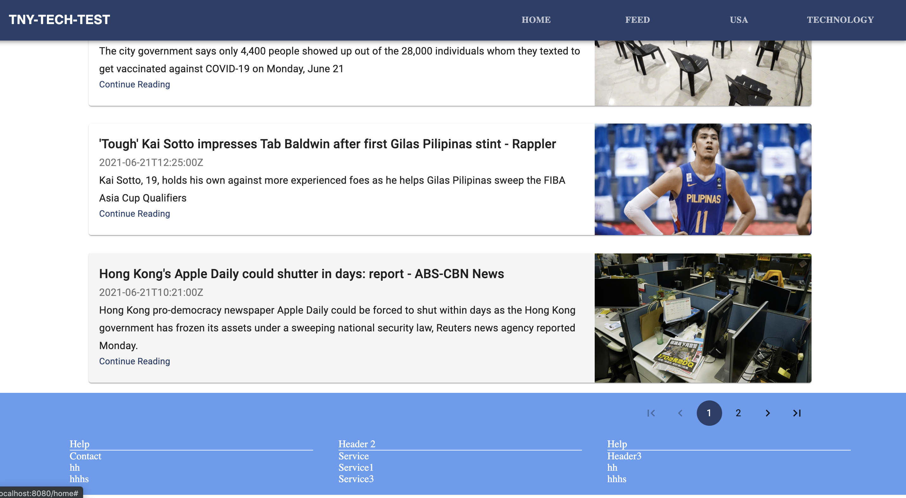
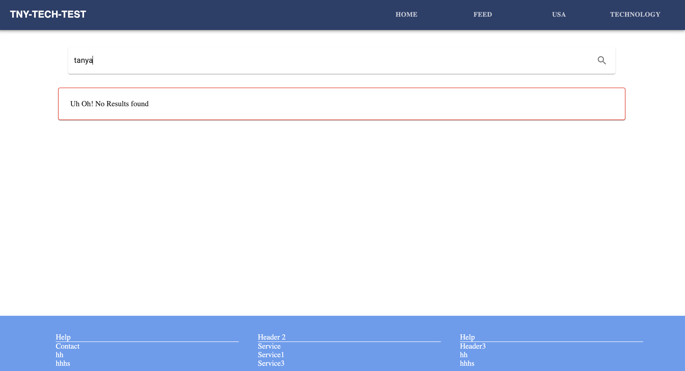

### Instructions to run the frontend Server

```
git clone https://github.com/tsah20/news-website-frontend
npm install
npm start
```

visit [http://localhost:8080](http://localhost:8080) to interact with frontend.

### Screens

#### Home Screen



#### Home Screen with paginated search results



#### Home Screen for mobile View


#### Home Screen when keyword is not found



### Technologies Used

- React JS : Frontend
- Material UI : Design System
- Node + Express : Backend
- React Router : Routing Library
- Jest : Testing Library

### Features

- Search News By keyword.
- Most Recent News Feed of the world
- Recent news By Category:
  - Country
  - Technology

### Tasks Completed

- Responsive Website
- Error Handling (Backend + Frontend )
- Connected with Node JS server in the backend
- Most of the Components are A11Y Compliant
- Can load more data through navigation buttons (Feature only implemented for the search Page)
- Backend Test Cases
- Frontend Test Cases (In Progress)

### Limitation in the NewsAPI in free tier

1. Only 100 requests can be made in a day
2. At max 100 results of a search keyword can be viewed
3. The content in the response JSON is truncated
